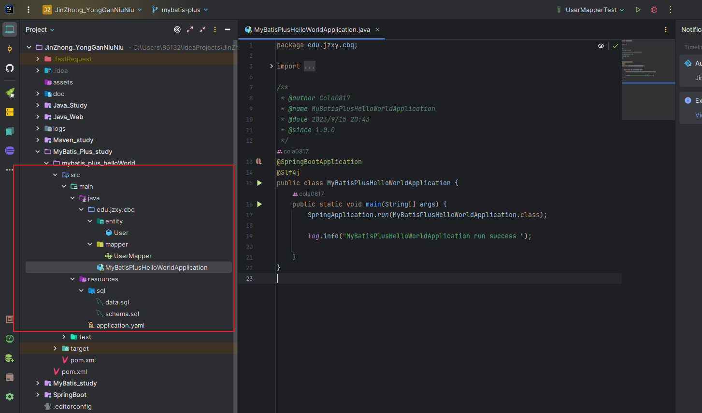
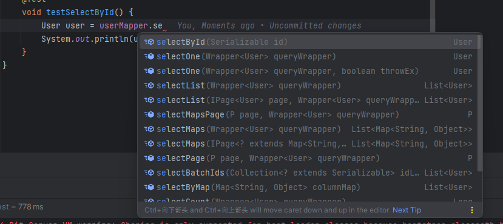
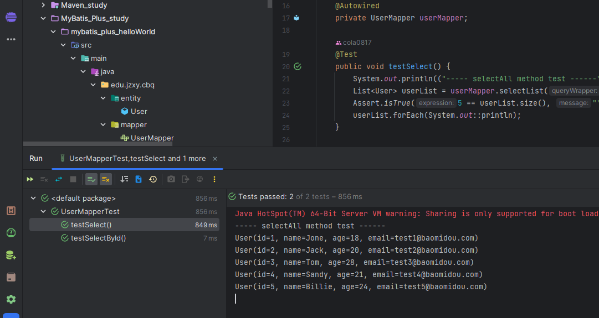

# MyBatisPlus 入门

 [MyBatis-Plus](https://github.com/baomidou/mybatis-plus) [ ](https://github.com/baomidou/mybatis-plus)（简称 MP）是一个 [MyBatis](https://www.mybatis.org/mybatis-3/)  的增强工具，在 MyBatis 的基础上只做增强不做改变，为简化开发、提高效率而生。


特性：

- **无侵入**：只做增强不做改变，引入它不会对现有工程产生影响，如丝般顺滑
- **损耗小**：启动即会自动注入基本 CURD，性能基本无损耗，直接面向对象操作
- **强大的 CRUD 操作**：内置通用 Mapper、通用 Service，仅仅通过少量配置即可实现单表大部分 CRUD 操作，更有强大的条件构造器，满足各类使用需求
- **支持 Lambda 形式调用**：通过 Lambda 表达式，方便的编写各类查询条件，无需再担心字段写错
- **支持主键自动生成**：支持多达 4 种主键策略（内含分布式唯一 ID 生成器 - Sequence），可自由配置，完美解决主键问题
- **支持 ActiveRecord 模式**：支持 ActiveRecord 形式调用，实体类只需继承 Model 类即可进行强大的 CRUD 操作
- **支持自定义全局通用操作**：支持全局通用方法注入（ Write once, use anywhere ）
- **内置代码生成器**：采用代码或者 Maven 插件可快速生成 Mapper 、 Model 、 Service 、 Controller 层代码，支持模板引擎，更有超多自定义配置等您来使用
- **内置分页插件**：基于 MyBatis 物理分页，开发者无需关心具体操作，配置好插件之后，写分页等同于普通 List 查询
- **分页插件支持多种数据库**：支持 MySQL、MariaDB、Oracle、DB2、H2、HSQL、SQLite、Postgre、SQLServer 等多种数据库
- **内置性能分析插件**：可输出 SQL 语句以及其执行时间，建议开发测试时启用该功能，能快速揪出慢查询
- **内置全局拦截插件**：提供全表 delete 、 update 操作智能分析阻断，也可自定义拦截规则，预防误操作

支持数据库：

- MySQL，Oracle，DB2，H2，HSQL，SQLite，PostgreSQL，SQLServer，Phoenix，Gauss ，ClickHouse，Sybase，OceanBase，Firebird，Cubrid，Goldilocks，csiidb，informix，TDengine，redshift
- 达梦数据库，虚谷数据库，人大金仓数据库，南大通用(华库)数据库，南大通用数据库，神通数据库，瀚高数据库，优炫数据库

mybatis-plus 总结：

- 自动生成单表的 CRUD 功能
- 提供丰富的条件拼接方式
- 全自动 ORM 类型持久层框架

# 一、MyBatisPlus QuickStart

## 1.1 数据库准备

现有一张 User 表，其表结构如下：

| id   | name   | age  | email                                           |
| ---- | ------ | ---- | ----------------------------------------------- |
| 1    | Jone   | 18   | [test1@baomidou.com](mailto:test1@baomidou.com) |
| 2    | Jack   | 20   | [test2@baomidou.com](mailto:test2@baomidou.com) |
| 3    | Tom    | 28   | [test3@baomidou.com](mailto:test3@baomidou.com) |
| 4    | Sandy  | 21   | [test4@baomidou.com](mailto:test4@baomidou.com) |
| 5    | Billie | 24   | [test5@baomidou.com](mailto:test5@baomidou.com) |

- schema 脚本

```sql
DROP TABLE IF EXISTS user;

CREATE TABLE user
(
    id BIGINT(20) NOT NULL COMMENT '主键ID',
    name VARCHAR(30) NULL DEFAULT NULL COMMENT '姓名',
    age INT(11) NULL DEFAULT NULL COMMENT '年龄',
    email VARCHAR(50) NULL DEFAULT NULL COMMENT '邮箱',
    PRIMARY KEY (id)
);

```

- data 脚本

```sql
DELETE FROM user;

INSERT INTO user (id, name, age, email) VALUES
                                            (1, 'Jone', 18, 'test1@baomidou.com'),
                                            (2, 'Jack', 20, 'test2@baomidou.com'),
                                            (3, 'Tom', 28, 'test3@baomidou.com'),
                                            (4, 'Sandy', 21, 'test4@baomidou.com'),
                                            (5, 'Billie', 24, 'test5@baomidou.com');

```

## 1.2 创建 boot 工程



- 引入依赖

```xml
    <dependencies>
        <dependency>
            <groupId>org.projectlombok</groupId>
            <artifactId>lombok</artifactId>
        </dependency>
        <dependency>
            <groupId>org.springframework.boot</groupId>
            <artifactId>spring-boot-starter-web</artifactId>
        </dependency>
        <dependency>
            <groupId>com.mysql</groupId>
            <artifactId>mysql-connector-j</artifactId>
        </dependency>
        <dependency>
            <groupId>com.baomidou</groupId>
            <artifactId>mybatis-plus-boot-starter</artifactId>
            <version>3.5.3.2</version>
        </dependency>
        <dependency>
            <groupId>org.springframework.boot</groupId>
            <artifactId>spring-boot-starter-test</artifactId>
            <scope>test</scope>
        </dependency>
    </dependencies>

```

- 实体类 

```java
@Data
public class User {
    private Long id;
    private String name;
    private Integer age;
    private String email;
}

```

- mapper

```java
@Mapper
public interface UserMapper extends BaseMapper<User> {

}
```


## 1.3 配置信息

```yaml
spring:
    datasource:
        driver-class-name: com.mysql.cj.jdbc.Driver
        url: jdbc:mysql://localhost:3306/mybatis-example
        username: root
        password: root
    sql:
        init:
            mode: always
            schema-locations: classpath:sql/schema.sql
            data-locations: classpath:sql/data.sql
```

## 1.4 Enjoy it ~

```java
    @Test
    void testSelectById() {
        User user = userMapper.selectById(1);
        System.out.println(user);
    }
```




## 1.5 测试

```java
@SpringBootTest
class UserMapperTest {

    @Autowired
    private UserMapper userMapper;

    @Test
    public void testSelect() {
        System.out.println(("----- selectAll method test ------"));
        List<User> userList = userMapper.selectList(null);
        Assert.isTrue(5 == userList.size(), "");
        userList.forEach(System.out::println);
    }

    @Test
    void testSelectById() {
        User user = userMapper.selectById(1);
        System.out.println(user);
    }
}
```




# 二、MyBatisPlus 核心功能

## 2.1 基于 Mapper 接口 CRUD


### 2.1.1 INSERT 方法

### 2.1.2 DELETE 方法

### 2.1.3 UPDATE 方法

### 2.1.4 SELECT 方法

### 2.1.5 自定义和多表映射


## 2.2 基于 Service 接口 CRUD


### 2.2.1 对比 Mapper 接口 CRUD 的区别

### 2.2.2 使用 IService 接口方式

### 2.2.3 CRUD 方法介绍

## 2.3 分页查询的实现


## 2.4 条件构造器使用


### 2.4.1 条件构造器的作用

### 2.4.2 条件构造器继承结构

### 2.4.3 基于 QueryWrapper 组装条件

### 2.4.4 基于 UpdateWrapper 组装条件

### 2.4.5 基于 LambdaQueryWrapper 组装条件

### 2.4.6 基于 LambdaUpdateWrapper 组装条件


## 2.5 核心注解使用


# 三、MyBatisPlus 高级扩展

## 3.1 逻辑删除实现

## 3.2 乐观锁实现

### 3.2.1 悲观锁和乐观锁场景和介绍

### 3.2.2 使用 MyBatisPlus 乐观锁


## 3.3 防全表更新和删除

# 四、MyBatisPlus 代码生成器

## 4.1 MyBatisX 插件逆向工程

## 4.2 MyBatisX 快速代码生成

